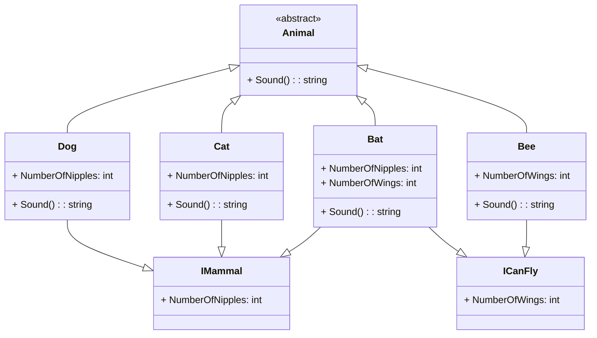

```mermaid
classDiagram
    class Animal {
        <<abstract>>
        + Sound(): string
    }
    class Dog {
        + NumberOfNipples: int
        + Sound(): string
    }
    class Cat {
        + NumberOfNipples: int
        + Sound(): string
    }
    class Bat {
        + NumberOfNipples: int
        + NumberOfWings: int
        + Sound(): string
    }
    class Bee {
        + NumberOfWings: int
        + Sound(): string
    }
    class IMammal {
        + NumberOfNipples: int
    }
    class ICanFly {
        + NumberOfWings: int
    }

    Animal <|-- Dog
    Animal <|-- Cat
    Animal <|-- Bat
    Animal <|-- Bee

    Dog --|> IMammal
    Cat --|> IMammal
    Bat --|> IMammal
    Bat --|> ICanFly
    Bee --|> ICanFly

```